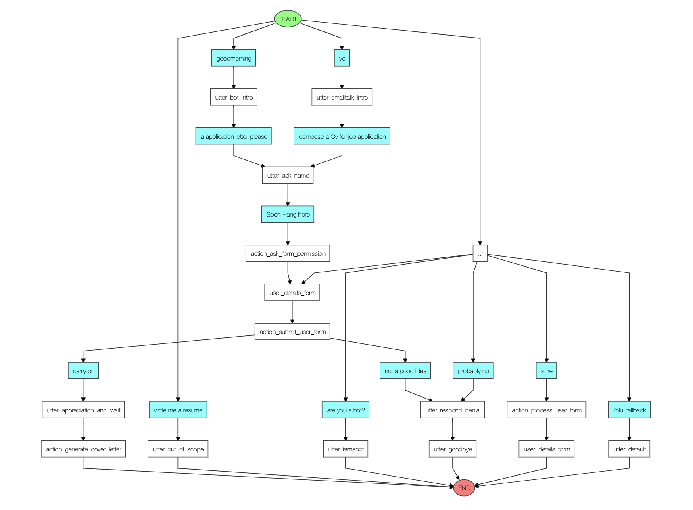
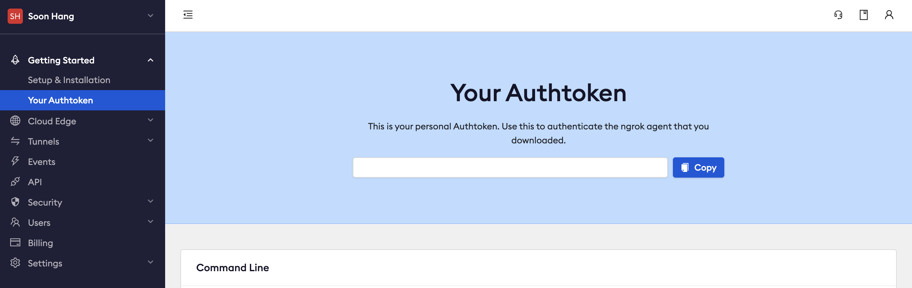
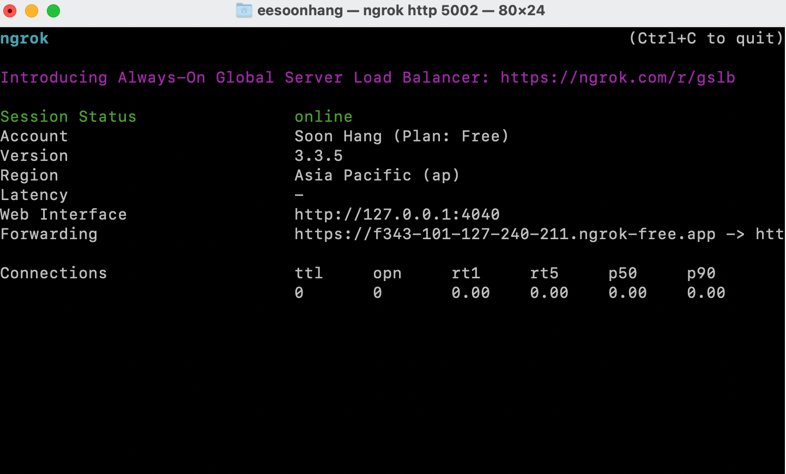
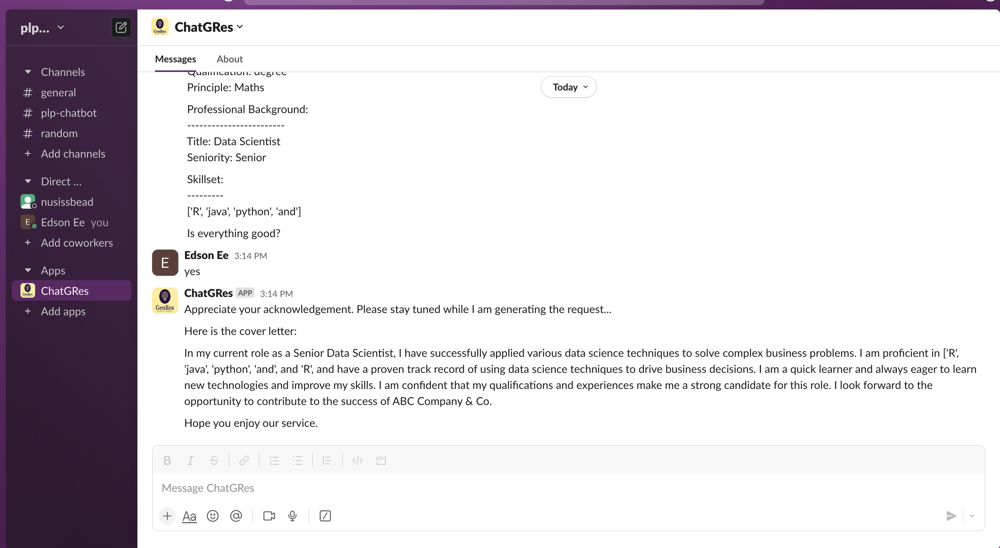

<div align="center">
    
</div>
<br />

# User Guide for ChatGRes
    * This user guide aims to provide two objectives:
        * a technical overview of the technology stacks in place for the chatbot development
        * a simple and intuitive set of instructions to install and interact with the GenRes CUI
    * By reading this document, user would understand the expected behaviour of the virtual assistant from both technical and functional aspects

## Technical Design of GenRes CUI

### Understand Main Framework:
    * This CUI adopts Open Source RASA framework due to its strong supporting community group and extensibility across closed-group and open-group implementation
    * This CUI utilises RASA core to navigate through various expected scenarios during user interaction and execute pre-defined events for exception handling
    * This CUI utilises RASA nlu to perform two main tasks while interacting with main users, namely: Intent Classification, Entity Recognition
    * This CUI leverages a built-in Action Server for contextual awareness enhancement and personalization during human interaction

### Understand Built-in Components:
1. actions 
    * house the custom logics for event handling
    * provide capabilities for third party integration
    * default port for rasa action server is 5055
2. data
    * comprise of training data (nlu.yml) that is annotated based on pre-defined structure
    ```example
    I work as a [Junior]{"entity":"profession", "role":"seniority"} [Business Analyst]{"entity":"profession", "role":"title"}
    ```
    * could house lookup table for various business context to enhance model training
    * comprise of rules or stories that is used to promote various scenarios during human interaction
        * stories provides flexibility to customize user journey
        * rules to enhance specific business logics
3. models
    * house the trained chatbot model that can be hosted on local server
    * default port for rasa chatbot server is 50005
4. config.yml
    * configuration for NLU and core models
    * outline the pipeline used for model training
    * outline the policy adopted to navigate exception or ambiguity
    * provide option to implement history tracking
5. credential.yml
    * house details for connecting to other services such as token or secret key
    * provide options to connect with third party platform via REST protocol or web socket
6. domain.yml
    * acts as a referenced package that is used to define how the virtual assistant should act and respond
    * house all properly defined 
        * intent
        * entity
        * slot
        * bot responses
        * custom form
        * custom actions
7. endpoint.yml
    * house details for connecting to external channels
    * provide capability to implement custom endpoint

## Functional Design
1. Key Intent
    * As of 22 Oct 2023, ChatGRes is only capable of performing lightweight cover letter composition
2. Key Entities, refer to [sample table](https://github.com/lkimhui/PLP_Project/tree/users/soonhang/chatbot/data/lookup)
    * cv: cover letter
    * resume: resume
    * name: user's name
    * profession: user's current professional background
    * skillset: user's technical strength
    * education: user's level for educational background
    * principle: user's principle for educational background
3. Dialog Policy
    <br/>
    <div align="center">
    
    </div>
    <br/>
4. Fallback Implementation
    * Low confidence level (<0.3) for intent classification
        * action: utter default for rephrase request
    * Out of scope
        * scope: request for resume
        * action: utter out of scope to articulate current bot's potential

## Instruct Bot
### Copy the Working Model
1.  Git clone this repo
    ```bash
    git clone git@github.com:lkimhui/PLP_Project.git
    ```
2. Check your current working branch
    ```bash
    git branch
    ```
3. Checkout working branch for chatbot
    ```bash
    git checkout users/soonhang
    ```
4. Ensure the existence of chatbot folder

### Enable Integration : Open-group / Public
1. inside config.yml, add action_endpoints: with webhook url socket address
	```yml
	action_endpoint:
  	  url: "http://localhost:5055/webhook"
	```

2. inside endpoints.yml, uncomment action_endpoint to enable custom action response
	```yml
	action_endpoint:
	  url: "http://localhost:5055/webhook"
	```

3. inside credential.yml, uncomment socketio and filled up as per below:
	```yml
	socketio:
	  user_message_evt: user_uttered
	  bot_message_evt: bot_uttered
	  session_persistence: true
	```

4. Web HTML with Chat Widget
    - create a .html page within the same folder if index.html could not be found
    - paste below script within html body
	In your `<body/>`:
	```html
	<script>!(function () {
	  let e = document.createElement("script"),
	    t = document.head || document.getElementsByTagName("head")[0];
	  (e.src =
	    "https://cdn.jsdelivr.net/npm/rasa-webchat@1.x.x/lib/index.js"),
	    // Replace 1.x.x with the version that you want
	    (e.async = !0),
	    (e.onload = () => {
	      window.WebChat.default(
	        {
	          customData: { language: "en" },
	          socketUrl: "https://bf-botfront.development.agents.botfront.cloud",
	          // add other props here
	        },
	        null
	      );
	    }),
	    t.insertBefore(e, t.firstChild);
	})();
	</script>
	```
    - on cmd line, run:
	```bash
	rasa run -m models --enable-api --cors "*"
	```
    - launch a new terminal, on cmd line, run:
	```bash
	rasa run actions
	```

#### Enable Integration : Closed-group / Private
1. Create a Ngrok Account to bridge the Chatting Platform
    - register a [ngrok account](https://dashboard.ngrok.com/login)
    - login your ngrok account after successful registration
    - copy your auth token and save it to a secured document or folder
        <br/>
        <div align="center">
        
        </div>
        <br/>
    - install ngrok on local machine based on your OS system
    - test your ngrok setup by following below:
        - on your chatbot cmd / terminal, run: 
            rasa run --port `<port>` -m models --enable-api --cors "*"
        - open a new cmd / terminal, run: 
            ngrok config add-authtoken `<your_ngrok_token>`
        - on the new cmd line, run: 
            ngrok http `<port>`

2. Host to Slack Platform
    - ensure you have a [Slack Account](https://slack.com/get-started#/createnew)
    - login your slack account
    - create a new workspace to house your app
    - on the browser, go to [slack api](https://api.slack.com/)
        - navigate to `Your apps`
        - hit the `Create New App` button
        - navigate to `Basic Information` section, fill up the basic information as instructed
        - once filled up Basic Information, navigate to `OAuth & Permission`
        - add below to `Bot Token Scopes`
            * chat:write
            * im:read
            * im:write
            * im:history
            * mpim:history
        - Scroll up and click `Install App`
            * a pop-up window will appear to ask for permissions on your workspace
            * go ahead and click `Allow`
    - now you need the KEY to connect
        - navigate to `OAuth & Permissions`
        - under `Token for Your Workspace`, you shall see an Access Token start with `xoxb-`
        - copy the access key
    - navigate to your chatbot folder, look for credentials.yml
        - uncomment command lines as shown below:
            ```yml
            slack:
            slack_token: "your_access_token"
            slack_channel: "your_workspace_id_not_name"
            ```
        - update the command lines accordingly
    - lastly, we need both rasa actions, ngrok and rasa shell to be running together
        - launch your rasa actions server as shown below
            ```bash
            rasa run actions
            ```
        - on another cmd / terminal, launch your rasa server as shown below
            ```bash
            rasa run --port <port> -- connector slack --credentials credentials.yml --endpoints endpoints.yml -m models --enable-api --cors "*"
            ```
        - start ngrok on the rasa server port
            ```bash
            ngrok http <port>
            ```
        - on successful execution, you shall see below:
            <br/>
            <div align="center">
            
            </div>
            <br />
        - on your browser for setting up `slack app`
            - navigate to `Event Subscriptions`
            - under Enable Events, paste below:
                ```
                https://<ngrok_endpoint>:5002/webhook/slack/webhook
                ```
            - the response should return as `Verified`
            - lastly, scroll down to `Subscribe to bot events`, add below:
                * message:im
                * message:mpim
    - now, go back to your Slack workspace, you shall see the Chatbot App added to your `Apps` list
        <br/>
        <div align="center">
        
        </div>
        <br/>

## Prompt LLM Model
For first-hand experience with our fine-tuned LLM model, please follow instructions below to prompt the T5 model:
1. after git clone this project, cd to chatbot folder
2. currently, our T5 model can take in these inputs:
    ```
    user_name
    job_title
    qualification
    skillset
    past_working_experience
    preferred_qualification
    hiring_company_name
    current_working_experience
    ```
3. ensure below mentioned python files exist in `<llm>` folder
    * main.py
    * prediction.py
    * model_helper.py
3. to test the llm model response, run below python cmd
    ```bash
    python -m main
    ```
4. to use the module, import the packages as shown below
    ```
    from chatbot.llm import *
    from chatbot.llm import main as llm
    ```
    note `<chatbot>` is the main folder name and editable
5. in your own python script, create your input as illustrated below:
    ```json
    {
        "user_name": "your_name",
        "qualification": "your_qualification",
        "skillset": "your_skillset",
        "current_working_experience": "your_current_working_experience",
        "past_working_experience": "your_past_working_experience",
        "preferred_qualification": "hiring_company_preferred_qualification",
        "hiring_company_name": "hiring_company_name",
        "job_title": "hiring_company_job_title"
    }
    ```
6. set model_name as `t5-base-fine-tune-1024`
7. print below python code to console for text generation
    ```python
    llm.generate_cover_letter(input=input, model_name=model_name)
    ```
